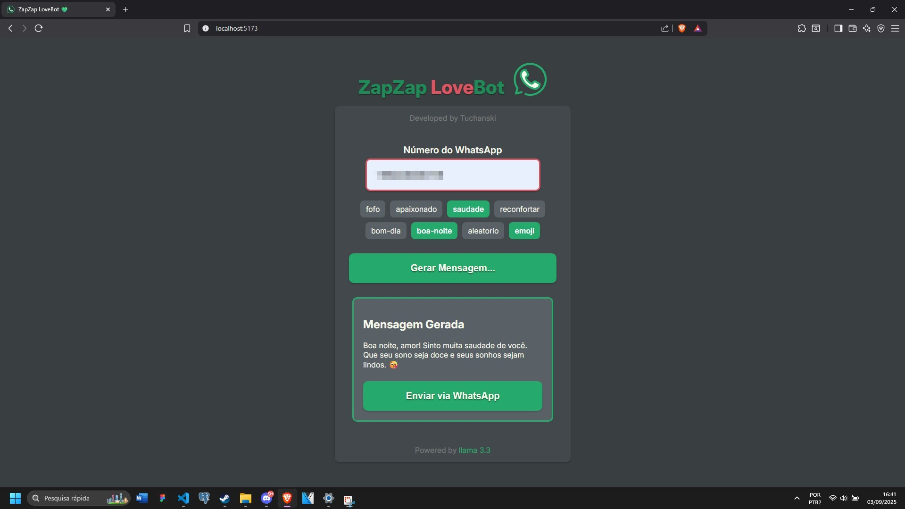

# 💌 ZapZap LoveBot

Um bot simples, fofo e automatizado que usa inteligência artificial para gerar mensagens carinhosas e enviá-las pelo WhatsApp. Ideal para impressionar sua namorada.

---

## ✨ O que ele faz?

1. Gera uma mensagem fofa usando o modelo **LLaMA 3.3** via **Groq API**
2. Exibe a mensagem gerada na interface web com **React**
3. Permite enviar a mensagem instantaneamente via **WhatsApp Web** com **pywhatkit**

---

## 🛠️ Tecnologias usadas

**Frontend:**

-   [React](https://reactjs.org/)

**Backend:**

-   [Python](https://www.python.org/)
-   [Flask](https://flask.palletsprojects.com/)
-   [Groq API](https://www.groq.com/) (usando `llama-3.3-70b-versatile`)
-   [pywhatkit](https://pypi.org/project/pywhatkit/) para automação do WhatsApp

---

## 📦 Instalação

### 1. Backend

1. Clone o repositório:

```bash
git clone https://github.com/tuchanski/zapzap-lovebot
cd zapzap-lovebot
```

2. Crie e ative um ambiente virtual:

```bash
python -m venv venv
# Windows
venv\Scripts\activate
# Linux / Mac
source venv/bin/activate
```

3. Instale as dependências:

```bash
pip install flask flask-cors pywhatkit groq
```

4. Configure a variável de ambiente `GROQ_API_KEY`:
```bash
# Windows
set GROQ_API_KEY=<sua_api_key>
# Linux / Mac
export GROQ_API_KEY=<sua_api_key>
```
Caso não tenha uma chave para a API do Groq, leia a [documentação](https://console.groq.com/docs/quickstart)

5. Rode o backend:

```bash
python app.py
```

O backend estará rodando em `http://127.0.0.1:5000`.

---

### 2. Frontend

1. Navegue até a pasta do frontend:

```bash
cd frontend
```

2. Instale as dependências:

```bash
npm install
```

3. Rode a aplicação:

```bash
npm run dev
```

O frontend estará disponível em `http://localhost:5173`.

---

## 🚀 Como usar

1. Insira o número de WhatsApp do destinatário no campo **Número do WhatsApp**
2. Escolha as tags se quiser personalizar as mensagens carinhosas do **ZapZap Lovebot**
3. Clique em **Gerar Mensagem...** para criar uma mensagem fofa com IA
4. Clique em **Enviar via WhatsApp** para enviar a mensagem diretamente

> ⚠️ O envio depende do WhatsApp Web estar logado no navegador.

---

## 📸 Exemplo de uso



---

## ⚠️ Avisos

-   O `pywhatkit` abre o WhatsApp Web automaticamente no navegador.
-   É necessário estar logado no WhatsApp Web para o envio funcionar.
-   Use com responsabilidade e carinho.

---

## 📄 Autor

Feito com amor por [Tuchanski](https://github.com/tuchanski) 💕
